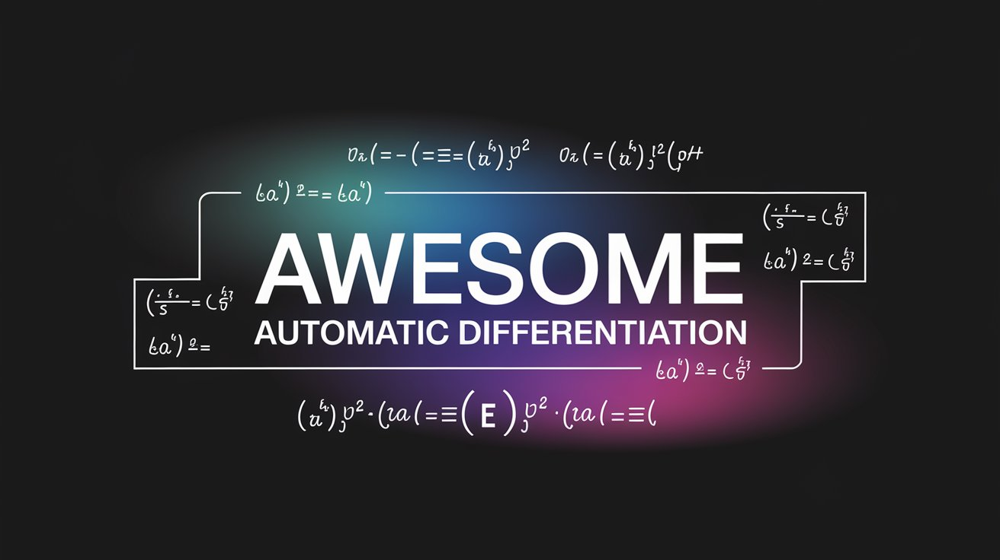

# Awesome Automatic Differentiation 

Image Courtesy: Some LLM

## About this Repository

In the anatomy of any modern deep learning framework, you'll find a few major components:

- A library for neural network layers
- A set of data loading utilities
- A shim to support different accelerated backends
- An Automatic Differentiation Engine to tweak you network params and minimize your losses

I found a plenty of resources around the first three but while trying to understand automatic differentiation tools, I found myself struggling to find a curated set of resources in one place. So this repository is meant to be the resource that I wish I had when I started.

Disclaimer: This repo might be little biased towards Python related content since that is my language of choice. Julia also seems to have a strong community around automatic differentiation tools, I'll add more content around it soon.

## Videos / Talks

- [PyCon US: Colin Carroll - Getting started with automatic differentiation](https://www.youtube.com/watch?v=NG21KWZSiok) - One of the very few talks about this topic in PyCon. Colin Carroll gives a very nice high-level overview for beginners and provides a few examples in Tensorflow, PyTorch and JAX.

- [What is Automatic Differentiation?](https://www.youtube.com/watch?v=wG_nF1awSSY) - This is the video that I highly recommend beginning with to understand auto diff. Ari does a brilliant job of breaking down different types of differentiations and then goes deeper into Automatic Differentation. Made in a 3Bblue1Brown style animated video, with a lot of good reference links in the description.

- [DLSys Course from CMU](https://dlsyscourse.org/lectures/) - This is an amazing course by CMU that takes you through building an entire deep learning framework from scratch in Python. Lecture 4 & 5 are focussed on Automatic Differentation.

  - [Lecture 4 Automatic Differentiation](https://www.youtube.com/watch?v=56WUlMEeAuA)
  - [Lecture 5 Automatic Differentiation Implementation](https://www.youtube.com/watch?v=cNADlHfHQHg)

## Tutorials / Blog posts

- [How to Differentiate with a Computer](https://www.ams.org/publicoutreach/feature-column/fc-2017-12) - This article by the American Mathematical Society goes a little deeper into the maths behind autodiff.

- [Tutorial on Automatic Differentiation](https://www.youtube.com/watch?v=he_86Y4lQLw) - Prof. Matt Yedlin takes the above article by AMS and explains it in detail in this Youtube video.

- **PyTorch focussed tutorials** - `Autograd` is PyTorch's underlying automatic differentiation engine. These tutorials/articles are either solely focussed on implemention using PyTorch or are from the official documentation.

  - [PyTorch Autograd Explained - In-depth Tutorial](https://www.youtube.com/watch?v=MswxJw-8PvE) - This video is featured in the official Pytorch docs. Elliot does an amazing job of visually explaining the working of autograd in details.

  - [The Fundamentals of Autograd](https://pytorch.org/tutorials/beginner/introyt/autogradyt_tutorial.html) - Official docs covering the basic aspects of autograd.

  - [Automatic Differentiation with torch.autograd](https://pytorch.org/tutorials/beginner/basics/autogradqs_tutorial.html) - Another beginner level official tutorial on autograd.

  - [A Gentle Introduction to torch.autograd](https://pytorch.org/tutorials/beginner/blitz/autograd_tutorial.html) - Yet another beginner level official tutorial on autograd.

  - [Autograd mechanics](https://pytorch.org/docs/stable/notes/autograd.html) - Another official doc that goes deeper into the inner workings of autograd engine.

  - [Simple Grad](https://colab.research.google.com/drive/1VpeE6UvEPRz9HmsHh1KS0XxXjYu533EC) - Colab notebook from official PyTorch documentation showcasing reverse mode AD implementation.

- **Tensorflow focussed tutorials** - TensorFlow uses GradientTape as the automatic differentiation engine.

  - [Introduction to gradients and automatic differentiation](https://www.tensorflow.org/guide/autodiff) - Basic official tutorial about using GradientTape.

  - [Advanced automatic differentiation](https://www.tensorflow.org/guide/advanced_autodiff) - This official tutorial covers advanced and less common features of the GradientTape API.

- **JAX** - JAX is comparatively new Python library by Google for accelerator-oriented array computation and program transformation, designed for high-performance numerical computing and large-scale machine learning. They also provide automatic differenetiation capabilities out of the box.

  - [Automatic differentiation](https://jax.readthedocs.io/en/latest/automatic-differentiation.html) - Beginner official JAX tutorial on automatic differentiation.

  - [Advanced automatic differentiation](https://jax.readthedocs.io/en/latest/_tutorials/advanced-autodiff.html) - Advanced tutorial covering higher-order derivatives, Hessians, Jacobians, etc.

  - [The Autodiff Cookbook](https://jax.readthedocs.io/en/latest/notebooks/autodiff_cookbook.html) - As the title suggests, this provides small code samples for different applications.

## Research Papers

- [Automatic Differentiation in Machine Learning: a Survey](https://www.jmlr.org/papers/volume18/17-468/17-468.pdf) - A survey paper published in JMLR 2018 which is one of the top peer-reviewed journals in machine learning. This cover what AD is and what it is not, different AD modes and how it converged into the field of machine learning.

- [Tangent: Automatic Differentiation Using Source Code Transformation in Python](https://arxiv.org/abs/1711.02712) - Published in 2017, Tangent is a library by google that performs automatic differentiation using source code transformation. This work compares the working of Tangent with Tensorflow and HIPS Aurograd which used Tracing for AD.

- [Tangent: Automatic differentiation using source-code transformation for dynamically typed array programming](https://proceedings.neurips.cc/paper_files/paper/2018/file/748d6b6ed8e13f857ceaa6cfbdca14b8-Paper.pdf) - Another paper by Google Brain that is published in NeurIPS 2018 which is another high rated conference in machine learning and AI.

- [Automatic Functional Differentiation in JAX](https://arxiv.org/abs/2311.18727) - Published in ICLR 2024 by SEA AI Lab, this work extends JAX to add capabilities to automatically differentiate higher-order functions.

- [Automatic differentiation in PyTorch](https://openreview.net/pdf?id=BJJsrmfCZ) - Published in NIPS 2017 by Facebook AI Research, University of Oxford and University of Warsaw, this is a short paper covering the design and implementation of PyTorch's autograd module.

- [A Benchmark of Selected Algorithmic Differentiation Tools on Some Problems in Computer Vision and Machine Learning](https://arxiv.org/abs/1807.10129) - This paper cover the benchmarking of various AD tools written in C++, Python, Jilua & Matlab.

- [Publications on autodiff.org](https://www.autodiff.org/?module=Publications&submenu=list%20publications&order=title&search[letter]=A) - A set of conference papers and journal articles.

## Books

I love slow media, the slower the better. Even though the tech changes rapidly everyday, tech books always had a special place in my life. This section describes some of the books I've found around AD.

- [Architecture of Advanced Numerical Analysis Systems](https://link.springer.com/book/10.1007/978-1-4842-8853-5) - "Designing a Scientific Computing System using OCaml" is in the title of the book. Although not entirely focussed on Automatic Differentiation, the author of Owl (OCaml based numerical computing library) takes the readers through building such a system. This includes writing algorithmic differentiation engine, performance accelerators, compiler backends for it and so on.

- [Books listing on autodiff.org](https://www.autodiff.org/?module=Introduction&submenu=Books) - This website hosts a list of published papers and books around automatic differentiation.

## Conferences

- [EnzymeCon](https://enzyme.mit.edu/conference) - EnzymeAD is an automatic differentiation tool that can take code as LLVM IR and differentiate it. EnzymeCon is an annual conference around it.
